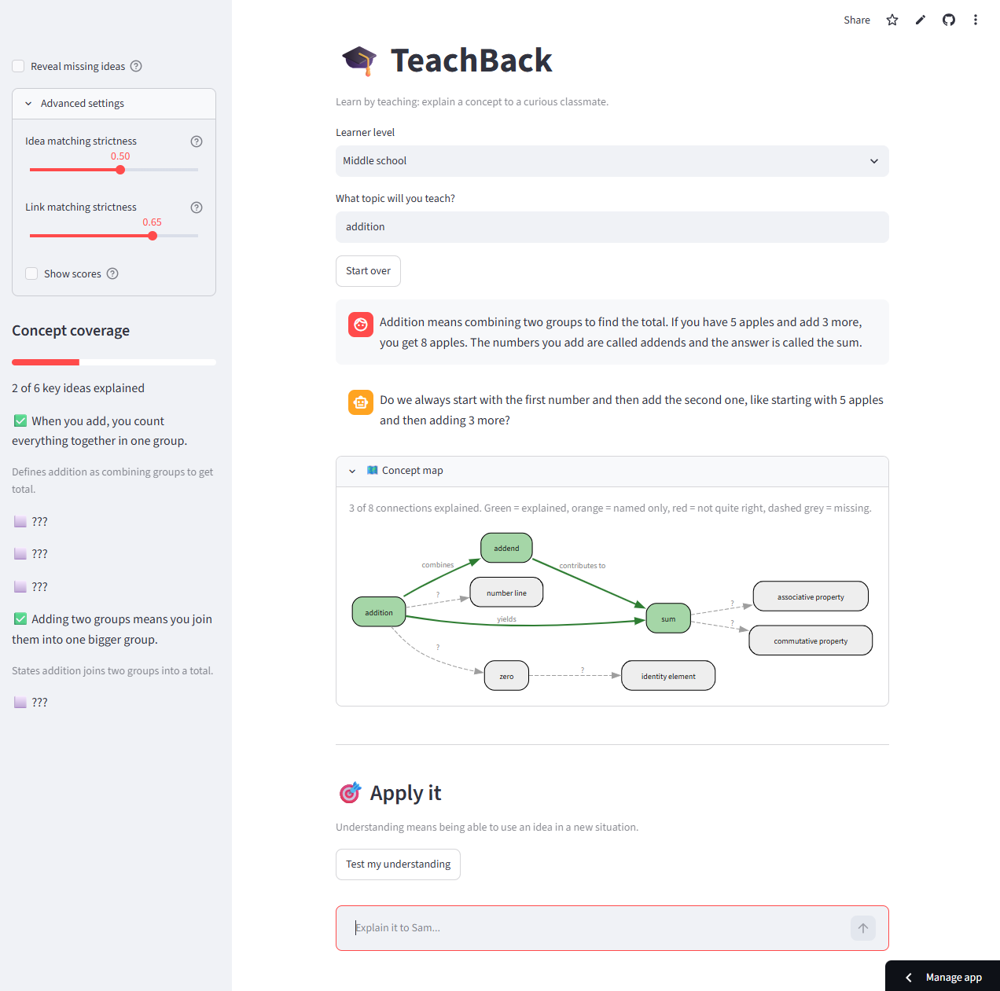
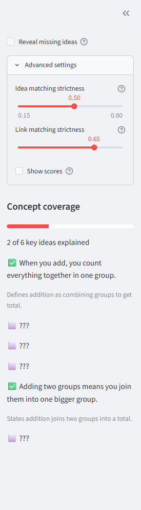
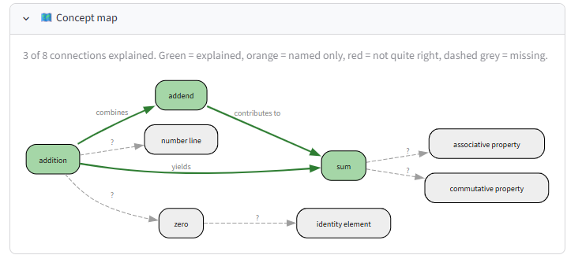

# 🎓 TeachBack

**Learn by teaching: explain a concept to an AI classmate, and find out what you really understand.**

🔗 **Live demo:** [teachbackai.streamlit.app](https://teachbackai.streamlit.app/)
🎥 **Demo video:** [Watch on YouTube](https://youtu.be/Ehg21y6h5gM)
🏆 **Track:** AI + Education (ForgeHacks 2026)



## The problem

Students can memorize a definition and still not understand the idea. Quizzes mostly test recall, and many AI tools simply hand over the answer. The track prompt asks for solutions that help learners "move beyond memorization to understand concepts, make connections, and apply what they learn." TeachBack targets each of those three goals.

## What it does

The student picks a topic and a learner level, then **teaches it to "Sam"**, an AI classmate who knows nothing and asks curious follow-up questions. Explaining something to someone else is a well-known way to reveal gaps in your own understanding.

| Prompt goal | Feature |
|---|---|
| **Understand concepts** | The app generates the key ideas of the topic and hides them. As you explain, each idea is marked explained, named only, not quite right, or missing, with a short reason. |
| **Make connections** | A concept map shows how the ideas link together. Terms are visible from the start, but link labels stay hidden as "?" until you explain the connection. |
| **Apply what you learn** | A new scenario tests whether you can use the idea. The AI grades your reasoning, not just your final answer, and gives a guiding question instead of the solution. |

Sam also uses your coverage results to steer his next question toward ideas you haven't explained yet, without giving them away.




## How it works

```
student explains → split into sentences → embedding model finds likely matches
→ LLM judge verifies (explained / named only / incorrect / missing)
→ results drive the sidebar, the concept map, and Sam's next question
```

1. **Retrieval (ML):** a sentence-embedding model (`all-MiniLM-L6-v2`) converts the student's sentences and each key idea into vectors. Cosine similarity finds candidate matches. Pairs of neighboring sentences are also compared, since students often explain one idea across two sentences.
2. **Verification (LLM):** embeddings measure topic closeness, not understanding. In testing, simply *naming* a term turned a concept-map link green, and a student who mixed up two properties still got credit. So a second stage asks an LLM judge whether the student actually explained each candidate correctly.
3. **Generation (LLM):** key ideas, concept maps, practice scenarios, and Sam's questions are generated by `openai/gpt-oss-120b` through the Groq API.
4. **Fallbacks:** if the LLM check fails, the app falls back to embedding similarity alone instead of crashing.

## What works and what doesn't

**What works**
- The full flow runs end to end: teach, coverage tracking, concept map, and apply-it scenario.
- Verification catches cases that similarity alone missed, such as naming a term without explaining it.
- Apply-it grading originally marked a correct answer as only "partial" and gave an irrelevant hint. I rewrote the grader to solve the problem first and to judge reasoning rather than wording, so brief answers are treated more fairly.

**Limitations (tested honestly)**
- The LLM judge can be wrong, especially on borderline answers and arithmetic checks, and results can vary between runs.
- Coverage and the concept map are graded separately, so they can occasionally disagree about the same explanation.
- Concept maps are generated by the LLM and can be uneven or loosely connected. Re-entering the topic regenerates the map.
- Key ideas and scenarios are AI-generated and not reviewed by a teacher, so they may contain mistakes or odd choices.
- Testing was informal and limited to two topics: addition and photosynthesis. It works best on well-known school topics.
- The demo uses a free API tier, so heavy use may cause slowdowns or errors.

## Run it locally

```bash
git clone https://github.com/alexus-Huang/teachback.git
cd teachback
python -m venv venv
venv\Scripts\activate        # Mac/Linux: source venv/bin/activate
pip install -r requirements.txt
```

Create a `.env` file in the project folder containing:

```
GROQ_API_KEY=your_key_here
```

(A free key is available at console.groq.com.) Then run:

```bash
python -m streamlit run app.py
```

The first run downloads the embedding model (about 90 MB), so it may be slow once.

## Project structure

```
app.py          Streamlit interface and main flow
llm.py          LLM client (Groq, OpenAI-compatible)
concepts.py     Generates key ideas and concept-map links
scoring.py      Embedding-based similarity matching
grader.py       LLM verification of matches
mapviz.py       Builds the concept-map graph
apply_it.py     Scenario generation and reasoning feedback
```

## Tech stack

Python, Streamlit, sentence-transformers, Groq API (OpenAI-compatible), Graphviz (via Streamlit).

## Ethics and responsible use

- TeachBack is a **practice tool, not an assessment.** Its judgments are AI estimates and should never determine a student's grade.
- It gives hints instead of answers, so students still do the thinking.
- Student text is sent to a third-party LLM API. A real classroom deployment would need privacy review and school or parental consent.
- AI-generated content can be wrong. Students and teachers should treat it as a starting point.

## What's next

- A teacher view showing which concepts a whole class tends to miss
- Spaced repetition that brings back shaky ideas later
- Teacher-reviewed key ideas for specific curricula
- Voice input, so students can explain out loud

## Built for

ForgeHacks 2026, AI + Education track. Built solo.